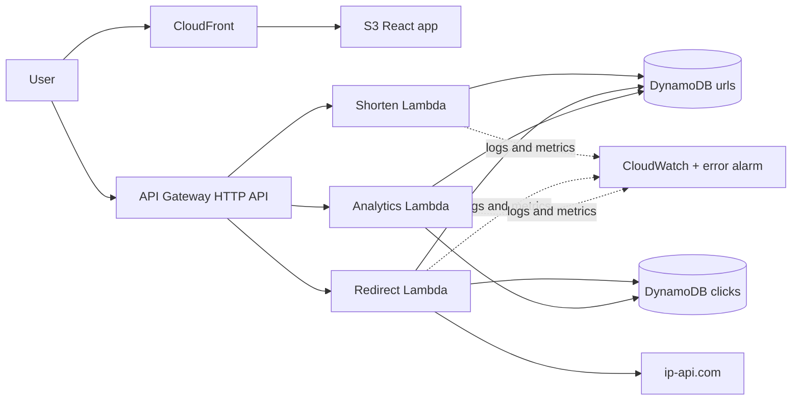
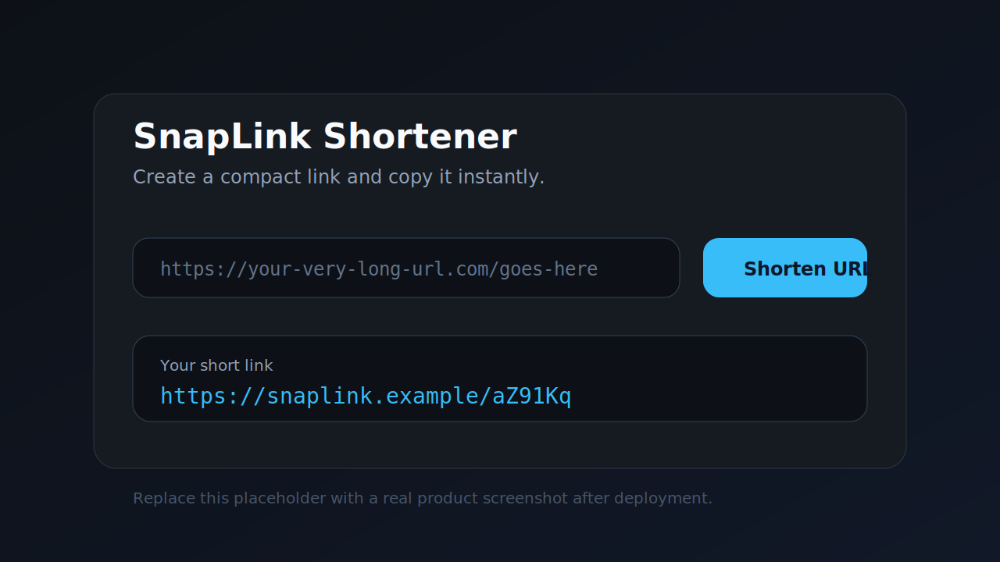
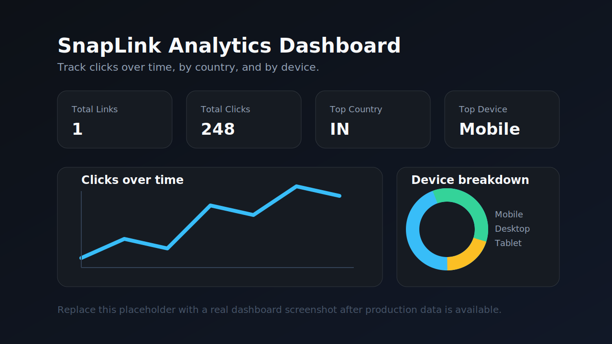

# SnapLink

SnapLink is a production-ready, serverless URL shortener with click analytics. It creates compact six-character links, redirects visitors with low latency, and presents country, device, browser, referrer, and time-series data in a responsive React dashboard.

> **Live demo:** [https://snaplink-eight.vercel.app](https://snaplink-eight.vercel.app)

## Architecture



The shorten Lambda uses a conditional `PutItem`, which handles collision protection and persistence in one call. The redirect Lambda reads the URL, records the event, atomically increments the counter, and returns a `301`. A separate read-only analytics Lambda keeps dashboard permissions isolated from the write path.

## Features

- Cryptographically random, fixed-width base62 shortcodes
- Strict HTTP/HTTPS URL validation and collision-safe writes
- Country lookup, device/browser parsing, referrer capture, and UTC timestamps
- Atomic click counters and chart-ready analytics aggregation
- Responsive React + Tailwind dashboard with Recharts
- Private encrypted S3 origin served through CloudFront Origin Access Control
- PAY_PER_REQUEST DynamoDB tables with server-side encryption
- Separate least-privilege IAM role for every Lambda
- X-Ray tracing, CloudWatch logs, and a 5-minute aggregate error-rate alarm
- Repeatable SAM deployment and GitHub Actions CI/CD

## Project Structure

```text
snaplink/
|-- backend/
|   |-- shorten/handler.py
|   |-- redirect/handler.py
|   |-- analytics/handler.py
|   |-- shared/utils.py
|   `-- requirements.txt
|-- frontend/
|   |-- src/
|   |   |-- components/
|   |   |-- App.jsx
|   |   `-- api.js
|   `-- package.json
|-- infrastructure/template.yaml
|-- .github/workflows/deploy.yml
`-- README.md
```

## Prerequisites

- An AWS account with free-tier eligibility
- Node.js 20+ and npm
- AWS SAM CLI
- Python 3.11
- AWS CLI configured with credentials that can deploy CloudFormation, Lambda, API Gateway, DynamoDB, IAM, S3, CloudFront, SNS, CloudWatch, and X-Ray resources

## Deployment

Run these steps in this exact order from the repository root.

1. Configure AWS credentials locally.

   ```bash
   aws configure
   aws sts get-caller-identity
   ```

   If you see `Unable to locate credentials`, the AWS CLI is not configured for your shell yet. Run `aws configure` again and enter:

   - `AWS Access Key ID`
   - `AWS Secret Access Key`
   - `Default region name` such as `us-east-1`
   - `Default output format` such as `json`

2. Validate and build the serverless application.

   ```bash
   sam validate --lint --template-file infrastructure/template.yaml
   sam build --template-file infrastructure/template.yaml
   ```

3. Deploy the backend and infrastructure.

   ```bash
   sam deploy --guided --capabilities CAPABILITY_NAMED_IAM
   ```

   Recommended guided values:

   - `Stack Name`: `snaplink-production`
   - `AWS Region`: `us-east-1`
   - `CorsOrigin`: your frontend URL, such as your Vercel domain
   - `ShortBaseUrl`: optional custom short-link domain
   - `AlarmEmail`: your email for CloudWatch alarm notifications

4. Read the deployed outputs.

   ```bash
   aws cloudformation describe-stacks --stack-name snaplink-production --query "Stacks[0].Outputs" --output table
   ```

5. Configure and build the frontend using the `ApiUrl` output.

   ```bash
   cd frontend
   copy .env.example .env
   npm install
   npm run lint
   npm run build
   cd ..
   ```

   Then set `VITE_API_BASE_URL` inside `frontend/.env` to the deployed `ApiUrl` value.

6. Upload the frontend to S3.

   ```bash
   aws s3 sync frontend/dist s3://YOUR_FRONTEND_BUCKET --delete
   ```

7. Invalidate CloudFront.

   ```bash
   aws cloudfront create-invalidation --distribution-id YOUR_DISTRIBUTION_ID --paths "/*"
   ```

8. Open the `FrontendUrl` stack output and test the full flow.

## Vercel Frontend Deployment

The frontend is also Vercel-ready.

1. Import the repository into Vercel.
2. Set the root directory to `frontend`.
3. Use the Vite framework preset.
4. Add `VITE_API_BASE_URL` as an environment variable with the deployed SAM `ApiUrl`.
5. Redeploy the frontend.
6. If your frontend domain changed, redeploy SAM with `CorsOrigin` set to that Vercel domain.

## GitHub Actions

Add these required repository secrets under **Settings -> Secrets and variables -> Actions**:

- `AWS_ACCESS_KEY_ID`
- `AWS_SECRET_ACCESS_KEY`
- `AWS_REGION`

Optional secrets:

- `CORS_ORIGIN`
- `SHORT_BASE_URL`
- `ALARM_EMAIL`

Every push to `main` validates and deploys SAM, discovers stack outputs, lints/builds React, syncs the build to S3, uploads `index.html` with no-cache revalidation, and invalidates CloudFront.

## API Documentation

All JSON responses include CORS headers. Replace `API_URL` below with the `ApiUrl` CloudFormation output.

### `POST /shorten`

Creates a short link.

Request:

```http
POST /shorten HTTP/1.1
Content-Type: application/json

{"url":"https://example.com/a/very/long/path"}
```

Success `201 Created`:

```json
{
  "shortcode": "aZ91Kq",
  "short_url": "https://API_URL/aZ91Kq",
  "original_url": "https://example.com/a/very/long/path",
  "created_at": "2026-06-22T10:30:00.000000Z"
}
```

Invalid URL `400 Bad Request`:

```json
{"error":"A valid http or https URL is required."}
```

Example:

```bash
curl -X POST "$API_URL/shorten" -H "Content-Type: application/json" -d '{"url":"https://example.com"}'
```

### `GET /{shortcode}`

Records a click and redirects to the original URL.

Success `301 Moved Permanently`:

```http
HTTP/1.1 301 Moved Permanently
Location: https://example.com/a/very/long/path
Cache-Control: no-store
```

Missing shortcode `404 Not Found`:

```json
{"error":"Short URL not found."}
```

### `GET /analytics/{shortcode}`

Returns summary metrics and chart-ready data for a link.

Success `200 OK`:

```json
{
  "shortcode": "aZ91Kq",
  "original_url": "https://example.com/a/very/long/path",
  "created_at": "2026-06-22T10:30:00.000000Z",
  "total_links": 1,
  "total_clicks": 3,
  "top_country": "IN",
  "top_device": "Mobile",
  "clicks_over_time": [{"date":"2026-06-22","clicks":3}],
  "clicks_by_country": [{"country":"IN","clicks":3}],
  "devices": [{"device":"Mobile","clicks":2},{"device":"Desktop","clicks":1}],
  "browsers": [{"browser":"Chrome","clicks":3}],
  "referrers": [{"referrer":"google.com","clicks":2},{"referrer":"Direct","clicks":1}]
}
```

## Analytics

The dashboard includes total links, total clicks, top country, and top device cards, plus daily click, country, and device visualizations. Browser and referrer values are retained in DynamoDB for future drill-down views.

### Shortener



### Analytics dashboard



## Operational Notes

- `ip-api.com` free-tier lookups use HTTP and are best-effort. Failed, private, or reserved IP lookups are stored as `Unknown` and never block redirects.
- The click event uses `(shortcode, timestamp)` as its DynamoDB key. Timestamps include microseconds to avoid collisions.
- The two DynamoDB tables and frontend S3 bucket are retained if the CloudFormation stack is deleted, protecting production data from accidental teardown.
- The analytics endpoint returns one link because it is scoped to a shortcode. Its `total_links` value intentionally reflects that single-link scope.

## Local Frontend Development

```bash
cd frontend
copy .env.example .env
npm install
npm run dev
```

Set `VITE_API_BASE_URL` in `frontend/.env` before calling the API.

## License

MIT
